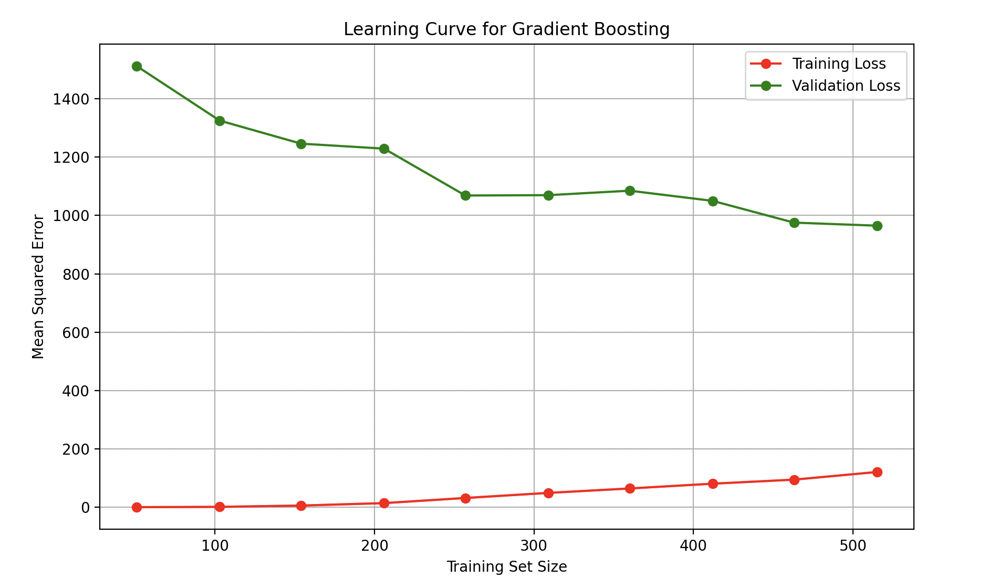

# Cherry
Cherry; a moonshot program to monitor, read, and predict blood glucose or interstitial fluids from the eyes

Below are the metrics for the best model compared to CGM benchmarks:

| Metric       | Best Model Value | CGM Benchmark |
|--------------|------------------|---------------|
| R²           | 0.49             | 0.94          |
| MSE          | 1038             | 6.2           |
| MAE          | 25               | 2.1           |
| MARD         | 21%              | 10.5%         |
| Sigma Level  | 0.40             | 3.0           |

As you can see, in current state, it is not very accurate or precise

Keep checking releases as I add more data from myself gathering data

Created by Joshua Thomas Brooks jtbrooks210@gmail.com

Any use or modification of this software must list this LICENSE file

Any commercialization of this software is subject to 51% of revenue going to the createor; Joshua Thomas Brooks jtbrooks210@gmail.com

Any patent of this software or earily similar software is subject to 51% of patent rights going to the createor; Joshua Thomas Brooks jtbrooks210@gmail.com

Feel free to modify, but any commercialization or patent of this software is subject to 51% of revenue going to the createor; Joshua Thomas Brooks jtbrooks210@gmail.com

If you want to make a donation feel free to on this site

If you want to contribute somehow; please send an email to me at jtbrooks210@gmail.com

Feel free to use at your leisure

I do not hold any liability for utilizing this software or any modifications of this software

This, as written, does not collect data, unless explicitly stated

This is a moonshot program
